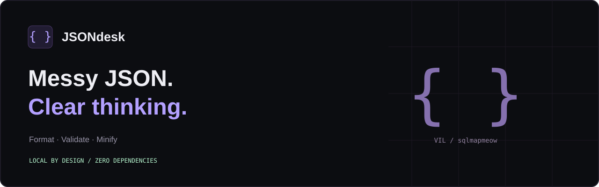

# JSON Desk

A lightweight, local-first JSON formatter and validator built with vanilla JavaScript.
**No dependencies. No build step. No accounts.**

## Features

- Format with 2 or 4 spaces, minify, or validate without rewriting input.
- Syntax-colored output, line numbers, byte counts and error coordinates.
- Jump from an error message to the corresponding input position.
- Copy output or download it as a `.json` file.
- Open a local JSON file (read locally, never uploaded to a server).
- Large numeric literals, negative zero, exponent notation and key order stay intact.
- Duplicate keys are preserved and flagged with a warning.
- Keyboard shortcut: **Ctrl+Enter** / **Cmd+Enter** to format.
- Responsive dark layout, keyboard navigation and live status announcements.

## Run

Download or clone the repository, then open **`index.html`** in a modern browser.
Keep `style.css`, `favicon.svg` and the `src/` directory beside it.

For a localhost URL with predictable clipboard permissions, install Node.js 20+ and run:

```sh
npm start
```

Open **http://127.0.0.1:4173**. No `npm install` is needed.
The optional server serves static files and binds only to your own computer.

## Test

```sh
npm test
```

The dependency-free Node test suite covers valid/invalid syntax, formatting,
minification, escaped strings, precision, duplicate keys, key order, line/column
reporting, limits and idempotence. All 10 core tests passed in the creation environment.

Full browser visual and interaction verification was not completed in that environment:
a browser binary was unavailable and its download failed. Do the manual checks in
[`docs/manual-checks.md`](docs/manual-checks.md) before publishing.

## How it works

`src/core.js` tokenizes and validates JSON using a small recursive-descent parser.
Formatting changes only whitespace between tokens. It does **not** parse a document
into JavaScript numbers and then stringify it. This avoids silently changing a value
such as `900719925474099312345`.

`src/app.js` connects the parser to the interface. Output is built with DOM text nodes,
not interpreted as HTML. Editing input invalidates the old output so stale data cannot
be copied or downloaded accidentally.

```text
index.html             Page structure
style.css              Responsive theme
src/core.js            Validation and token-preserving formatting
src/app.js             UI interactions
server.cjs             Optional local static server
tests/core.test.cjs    Core tests
```

## Privacy

JSON is processed in memory in the current tab. There is no analytics, backend API,
localStorage, cookie storage or external font/CDN dependency. Refreshing or closing the
page loses your input. Downloads and clipboard copying happen only when you choose them.
The GitHub profile link leaves the application only when clicked.

## Limits and deliberate choices

- Input and syntax-highlighted output are limited to **1 MiB**; a compact deeply nested
  input can exceed the output limit after indentation. Minify still works within the limit.
- Maximum nested value depth: **120**. This is an application limit, not a JSON standard limit.
- Gutters show numbers for the first 10,000 lines; the document itself is not truncated.
- Highlighting falls back to plain text above 12,000 tokens.
- Strict JSON only: no comments, trailing commas, single-quoted keys or BOM prefix.
- Positions count UTF-16 code units, matching textarea selection offsets.
- Duplicate keys are accepted syntactically but are not interoperable with all consumers.
- No JSON Schema validation, tree editor, automatic repair or remote URL loading.
- Clipboard access may be denied on some browsers or local-file pages; the fallback
  selects the output for manual copying.

## Put it on GitHub

Create a public repository named **`json-desk`** under your account and upload the
**contents** of this folder. `index.html` and `README.md` belong at the repository root.
Do not upload only the ZIP file. No repository or deployment has been created for you.

Suggested repository description:

> A local-first JSON formatter and validator. Vanilla JavaScript, zero dependencies, precision-preserving output.

Suggested topics: `json`, `javascript`, `formatter`, `validator`, `developer-tools`, `vanilla-js`.

To host it with GitHub Pages, configure Pages to publish from the root of your chosen
branch (usually `main`). The project uses relative asset paths and needs no build.
Once deployed, add the actual Pages URL to this README and the repository About section.

## Project notes

Prepared for **VIL / sqlmapmeow** as a small AI-assisted portfolio project.
Read the parser and tests, try the edge cases, and customize it before presenting it
as a project you maintain. No professional experience or usage statistics are implied.
